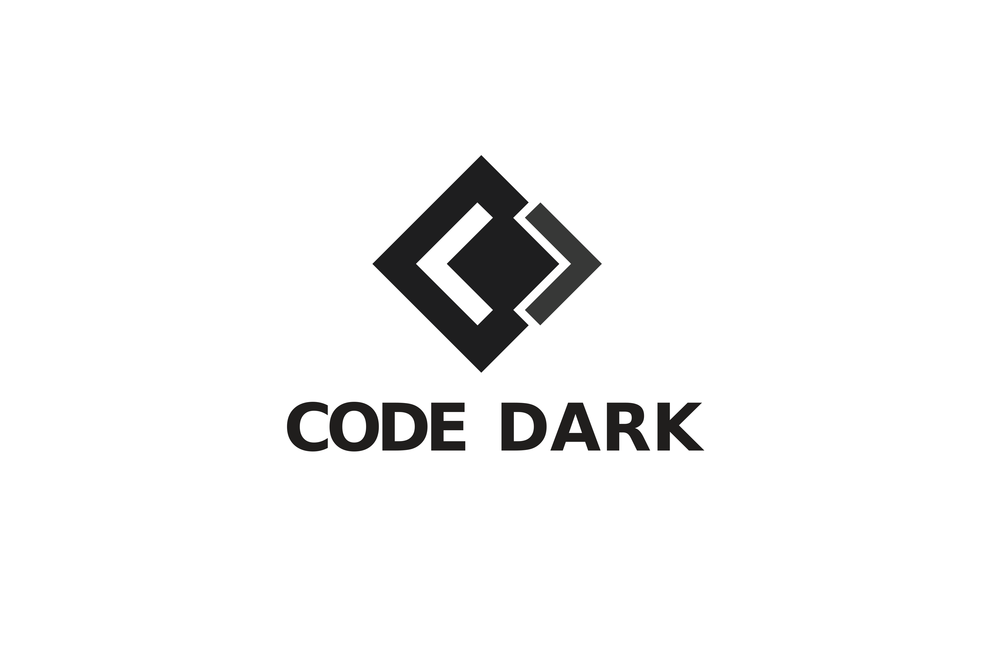

# *SEDME* Sistema estudiantil de definición de metas para Platzi Master

## Instalación

Abrir en consola el proyecto

`npm install`

Para ejeccutar el proyecto en modo desarrollo 

`npm run start`

## Acerca de
Proyecto front-end desarrollado con:
* SASS
* PUG
* HTML
* JAVASCRIPT
* WEBPACK 4

By:
